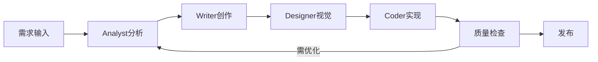

# 🤖 AI团队协作指挥中心

## 当前任务

### 📝 Writer-AI (内容创作)
**状态**: {{writer_status}}
**当前任务**: {{writer_task}}
**产出**: [[{{writer_output}}]]
**质量评分**: {{writer_score}}/100

### 💻 Coder-AI (代码开发)
**状态**: {{coder_status}}
**当前任务**: {{coder_task}}
**产出**: [[{{coder_output}}]]
**代码质量**: {{coder_score}}/100

### 🎨 Designer-AI (视觉设计)
**状态**: {{designer_status}}
**当前任务**: {{designer_task}}
**产出**: [[{{designer_output}}]]
**设计评分**: {{designer_score}}/100

### 📊 Analyst-AI (数据分析)
**状态**: {{analyst_status}}
**当前任务**: {{analyst_task}}
**洞察**: [[{{analyst_output}}]]
**准确性**: {{analyst_score}}/100

## 🔄 协作流程



## 📋 任务队列

| 优先级 | 任务 | 负责AI | 截止时间 | 状态 |
|--------|------|--------|----------|------|
| 🔴 P0 | {{task1_name}} | {{task1_ai}} | {{task1_deadline}} | {{task1_status}} |
| 🟡 P1 | {{task2_name}} | {{task2_ai}} | {{task2_deadline}} | {{task2_status}} |
| 🟢 P2 | {{task3_name}} | {{task3_ai}} | {{task3_deadline}} | {{task3_status}} |

## 💬 协作日志

### {{date:YYYY-MM-DD HH:mm}} - 任务启动
**Writer**: 开始创作"{{article_title}}"
**Analyst**: 关键词分析完成，建议优化方向...

### {{date:YYYY-MM-DD HH:mm}} - 中期检查
**Designer**: 封面设计完成，等待内容确认
**Coder**: 同步开发着陆页...

### {{date:YYYY-MM-DD HH:mm}} - 最终审核
所有AI: 质量检查通过，准备发布

## 🎯 优化建议

基于协作数据分析:
1. **瓶颈识别**: {{bottleneck}}
2. **效率提升**: {{efficiency_tip}}
3. **质量改进**: {{quality_tip}}

## 📊 团队绩效

```dataview
TABLE 
    sum(rows.tasks) as 总任务,
    avg(rows.quality) as 平均质量,
    sum(rows.output) as 总产出
FROM #ai-team
GROUP BY ai_name
```

---

#SYNC
#ANALYZE

*多AI协作系统 | 实时监控 | 自动优化*
